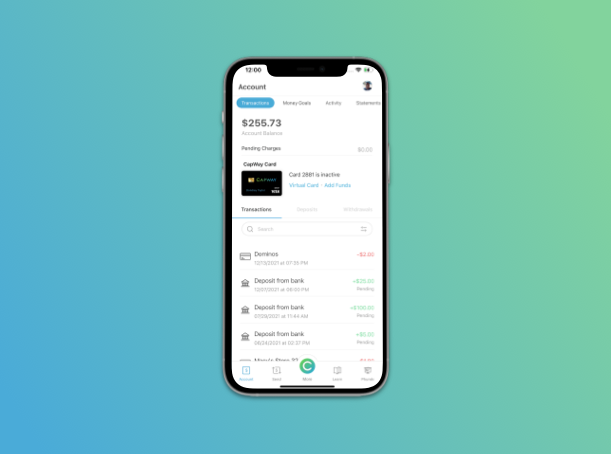

# CapWay Interview (iOS)
Referencing the designs below, create an iOS application that shows general account details with a few transactions.

## Design Preview

This screen can also be found within our app in the app store: 

https://apps.apple.com/us/app/capway-more-than-banking/id1217543033

## Requirements

- Fork this repo before making any changes
- Frequently commit your changes to GIT, with proper messages on each commit.
- General layout should consist of a tabbar, UITableView, and two UITableViewCells (one for the top part consisting of search and above, while the second consists a single transaction)
- Colors should be the same hex/rgb values that appear within the screenshots
- Code should be well documented, with adequate comments explaining relevant sections.
- Designs should scale down to at least iPhone 5 (preferrably using AutoLayout)
- Assets can be found within the assets folder of this repo
- Ignore all animations. The zoom in effect that appears when tapping an image does not need to be replicated, nor do you have to make it so that you can swipe on the image to get to the next.
- Search does not need to work
- Tapping on the options within the tab menu only needs to change the UIViewController to an empty white screen
- Pre-populate the screen with at least 10 transactions
- Use any transaction category icon beside each transaction UITableViewCell

### BONUS:
- Make top sliding navigation work in such a way that tapping on the menu options changes the screen to a white UIView
- Make it so that scrolling to the very bottom of the screens adds another 10 transactions (i.e. 10 UITableView Cells representing a transaction)

## Submitting
If you have any questions about the tech or design specifications or have submitted your application, please email dondrey@capway.com.

## Interaction Preview

The following demonstrates how the interactions pertaining to this coding challenge work when using the screen on a device. 

